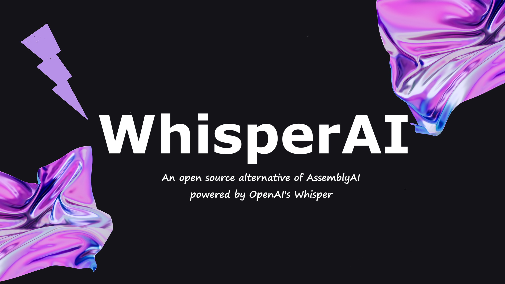

# WhisperAI
An open source alternative of AssemblyAI

## Installation

This project uses [uv](https://docs.astral.sh/uv/) for dependency management.

```bash
uv sync
```

To run commands inside the environment:

```bash
uv run python -m whisperai
```
